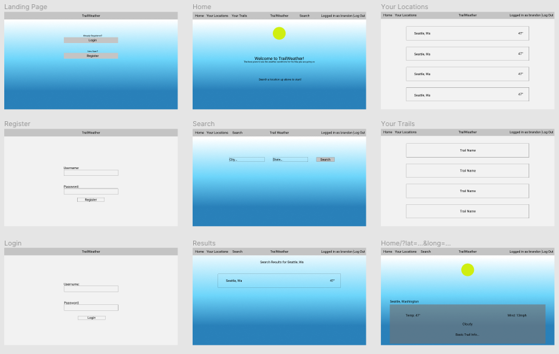
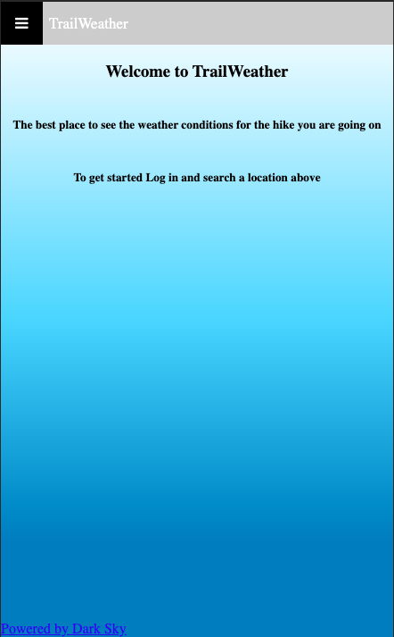

# TrailWeather
This is an app that uses the [Dark Sky API](https://darksky.net/dev/) along with the [Hiking Project API](https://www.hikingproject.com/data), and [Mapbox](https://docs.mapbox.com/mapbox-gl-js/api/?size=n_10_n) to make a website that will show trails around a location that you can search, and the weather in that location, so that you will have a better idea on what gear to bring, or just when to go on your hike. It also allows you to create an account and login with password encryption and authentification, with this account you can add locations and trails that you like to keep an eye on. This project builds upon the skills that we learned before from the first project and adds a whole new layer of complexity by utilizing Node.JS and a wide variety of other node modules to bring together a full stack application. Here is a link to the [Project](https://fast-coast-44019.herokuapp.com/).

## Day 1 

Today I spent the time I had completely for planning and setting up the foundation of this project. I decided that because of the scale of this project compared to the previous one that I wanted to use a wireframing website to help plan things better, so I settled on using FIGMA, a great designing tool. Here is my basic wireframe with small design ideas and plans on each page: 



Other than making that I also wrote down a good 4 to 5 pages of notes on things that I would need to either think about or include in this project. One of the most important pages here is my routes and database plan page, where I made up all of the routes based on the database that I designed to fit the needs of the project. 

## Day 2 
Today my main focus for the morning was to make sure that all of my routes hit along with making sure that I got all of the information on the page that I would need to display. These weren't too terrible to set up and I had them done with just one or two pieces of information on each page to make sure that the api calls were working. There was one page that was not working though, this was the specific trail page where I was going to show extra details on the trails. I am still not too sure why it wasn't working but after troubleshooting for a few hours I rewrote the call and instead of accessing my database for the trail ID I used the parameter that was in the url, which in hindsight is what I should have done in the first place because it is much cleaner.

## Day 3 
Because we had just been working for 2 weeks straight I decided to take today to not code as much, but I was still able to do a few things, including starting to add more information to the detail pages I was rendering along with look into using Skycons which I was not able to get working at the time.

## Day 4 
Today I got back to work on adding extra information to the details pages, and making things look a little better, like making the nav bar an actual nav bar that wasn't broken up line by line. Because I was starting to look into designing I had to backtrack a little bit and start to think mobile first. When seeing how to page as is loaded in the browser I found that I would have to have a hamburger menu of some sort, so I had to start designing and making that so that the nav bar wasn't ruined by the smaller width.



## Day 5 
My main focus today was to get the rest of the page details done with along with any other RESTful links that I need to include ex. in /trails/:id I needed to add a link to add trails to the users list. And here was when I found out that I had slightly messed up the way that I added and therefore displayed locations and trails. Both of them weren't correlated to a user at all, so if you were to sign in as someone else you would still have the same locations and trails saved. To fix this I had to rewrite the routes for those things completly and this time make use of ```javascript { include: [db.location] }``` and get/add Trails/Locations. Which was a bit rough just because getting the user ID into the route was something I wanted to keep somewhat secret, but ended up passing in through the url, just because this is a small project and the id's are all different but not very unique.

## Day 6
After fixing the issues yesterday I started working on what I had planned yesterday, which was to add extra details to all of the pages and lightly style them before really styling them tomorrow. This wasn't too bad the only real issue I had was getting Mapbox to work correctly, by the end of the day I had it displaying the trail name where it was supposed to, but I could not get a dot or icon to display after trying for quite some time. I do believe that I am close to having it working, all I need is a marker image to display and it should work I hope. Now that all of the info I need from the API's are displaying, I'm going to add on to my 220 lines of CSS and make things look exactly the way I want.

## Day 7 
As said before today is all styling, along with fixing anything that I can find UX-wise. This took not as long as I first expected because of the similarities on my site for example there are a lot of submit buttons therefore I can style those all the same just by using the class. The hard part here was just making up a color scheme, and sizing everything correctly, also flexbox is a savior.

## Day 8
Because we are presenting today I planned to use all of the morning to test and debug along with try to take on the small list of todo's that I made up while testing, no big changes were made, it was mostly just making sure that things worked the way they should. The biggest addition I made today was getting the Mapbox icons to work, the past few days I have been off and on struggling with it, but today it just decided that it would work for me.

## Future plans
I have been making a list of things I want to add post cohort, some of those things include a better search bar, which will instead of redirect you to a search form it will just be a bar up at the top that will allow you to search a city and state separated by a comma. Another idea I have is to add a Skycon to each of the daily weather tabs, I think this will make it look a bit better and give the user more of a summary than just the highs and lows of the day can. 
